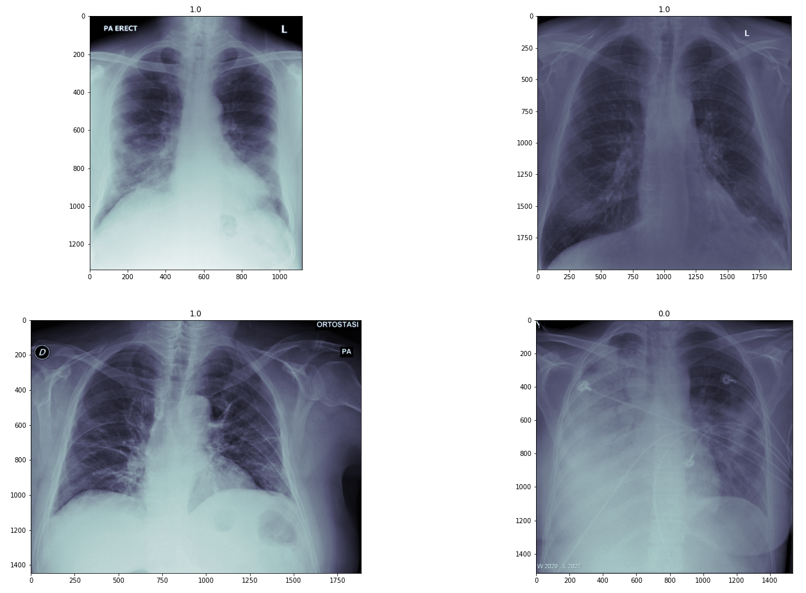

# covid-research
Research on Prognosis and Diagnosis of Covid-19

# Abstract
Recent developments in medical imaging with Deep Learning presents an evidence of automated diagnosis and prognosis. It can also be a compliment to currently available diagnosis methods.
Deep Learning can be leveraged for diagnosis, severity prediction, intubation support prediction and many similar tasks.
We present prediction of intubation support requirement for patients from the Chest X-ray using Deep representation learning.

# Dataset
Link: [covid-chestxray-dataset](https://github.com/ieee8023/covid-chestxray-dataset)

# Paper
[Predicting intubation support requirement of patients using Chest X-ray with Deep Representation Learning](https://www.researchgate.net/publication/344889411_Predicting_intubation_support_requirement_of_patients_using_Chest_X-ray_with_Deep_Representation_Learning?_sg=lFJw2U031kIrE19yyUc7n8q2boOZNR6LgQbgXRj9Tua8mxffAW7QifQpGXRGccbE973BdIHDXhtbBioDdnX1fjvyEfAYDaClpKGU1iLj.rVw_3xGP7u-PbUEqvsb1WgriCsB71paF7Gqoq-qb7KgS-WaGk_aEE-q7qnQCHZGYviVZXHiv4wZ8vwzz3E3KcA)

# Acknowledgement
- Thank you for creating [covid-chestxray-dataset](https://github.com/ieee8023/covid-chestxray-dataset)
- Chexnet implementation by [https://github.com/arnoweng/CheXNet/](arnoweng)
