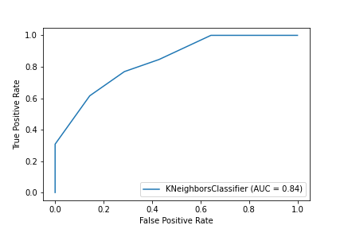

# covid-research
Research on Prognosis and Diagnosis of Covid-19

> Paper:
[Predicting intubation support requirement of patients using Chest X-ray with Deep Representation Learning](https://arxiv.org/abs/2011.01787)

# Abstract
Recent developments in medical imaging with Deep Learning presents an evidence of automated diagnosis and prognosis. It can also be a compliment to currently available diagnosis methods.
Deep Learning can be leveraged for diagnosis, severity prediction, intubation support prediction and many similar tasks.
We present prediction of intubation support requirement for patients from the Chest X-ray using Deep representation learning.

# Dataset
Link: [covid-chestxray-dataset](https://github.com/ieee8023/covid-chestxray-dataset)

# Experiment

0.84 AUC (95% CI 0.62, 0.86) on the test set

# Want to contribute?
Please reach out to me at theaniketmaurya@gmail.com

# Acknowledgement
- Thank you for creating [covid-chestxray-dataset](https://github.com/ieee8023/covid-chestxray-dataset)
